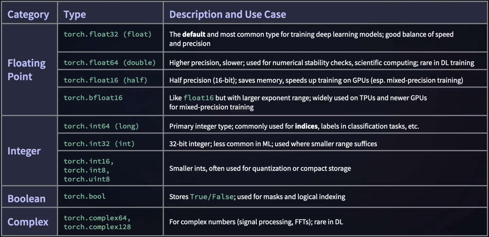

# Pytorch Tensors
It is the core data structure of PyTorch, a multidimensional array similary to Numpy's ndarry, and it supports **automatic differentiation** for deep learning. Think of tensor as a **generalized matrix** which can be of *any dimension*. For example zero dimensional tensors are *scaler numbers* like 0, 10, 100, etc. One dimensional tensors are *arrays* of numbers like `[9,8,7]`. Tensors can also be 2D. They are matrix of numbers like 2x3 matrix with a two-element array of an array of three, like `[[1,2,3],[7,5,3]]`. The 3D+ tensors are used for images, sequences, and models. 
## Primary PyTorch Tensor Data Types

We have 4 categories of data types, as shown in the picture above. For floating points `float32` is mostly used, where `float64` are rare for deep learning due to the slowness. `float16` is half the size of `float32` and it speeds up training on GPU while using less memory. `bfloat16` is good for TPUs and newer GPUs with larger exponent range.
<br>
For Integer data types, `int64` is the most common used for classification tasks. `32-bit` integers are used less commonly and only for smaller ranges. The other three are smaller ints used for quantization purposes, for storage and speed efficiency.
<br>
Boolean stores true or false. Complex numbers are less used in deep learning. 
### Examples
```python
# setting data types
a = torch.ones((2, 3), dtype=torch.int16)
# type casting
b = a.to(dtype=torch.float32)
```
## Tensor Transformations
Change the dimensions of the tensor:
- `Tensor.view(nrows, ncols)`
Flexibilities:
- In-place alterations
- Tensor copying
- Changing the share of the tensor, such as altering its dimensions

# PyTorch Basic Operations
Pytorch provides a rich set of arithmetic operations for tensors, supporting both element wise and matrix level computations. These operatios are similar to NumPy, but with added support for automatic differentiation and GPU acceleration.
## Major Categories of Operations
+ Common functions : abs, ceil, floor, clamp, trigonometric
+ Inverses of the common functions;: pi, sin, asin, bitwise
+ Comparisons
+ Reductions: max, min, std, prod, unique, vector/matrices
+ Linear algebra operations